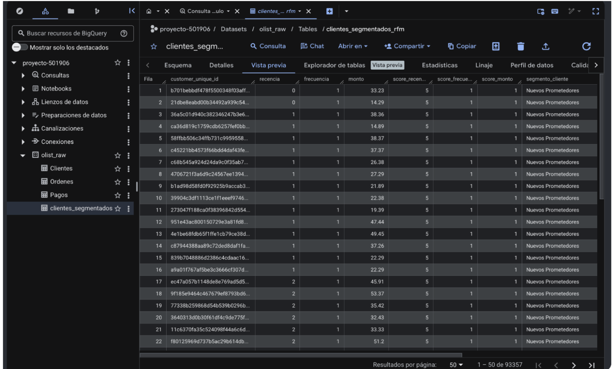

# Segmentación RFM de clientes del E-commerce Olist, Brasil
## Descripción del Proyecto

Implementación de un modelo de analítica avanzada RFM (Recencia, Frecuencia, Monto Monetario) en Google Cloud Platform para segmentar una base comercial de +93,400 clientes del dataset público de e-commerce Olist Brazil.

El objetivo fue automatizar la identificación de segmentos estratégicos de alto valor, habilitando decisiones de marketing basadas en datos reales.

## Arquitectura del Pipeline
[Datos Crudos CSV] -->
[Cloud Storage — Data Lake] -->
[BigQuery — Data Warehouse] -->
[Tabla: clientes_segmentados_rfm] --> 
[Looker Studio — Dashboard Ejecutivo]

## Lógica RFM en SQL

El modelo calcula tres dimensiones por cliente:

- **Recencia**: días transcurridos desde la última compra (`DATEDIFF`)
- **Frecuencia**: número total de órdenes completadas
- **Monto**: suma total gastada en el período

Cada dimensión se convierte en un score del 1 al 5 usando `NTILE(5)`, y luego se combinan con `CASE WHEN` para asignar el segmento final.

## Dashboard

El dashboard final muestra:

- KPIs ejecutivos: ventas totales, número de clientes, ticket promedio y recencia promedio
- Distribución de clientes por segmento (gráfico de barras y torta)
- Tabla comparativa de monto y recencia por segmento

**Vista modo oscuro:**

**Tabla de resultados en BigQuery:**

## Insights de Negocio
1. **Oportunidad VIP**: El segmento Campeones/VIP (solo 117 clientes) genera un ticket 3.5x superior al promedio — prioritario para programas de fidelización y beneficios exclusivos.
2. **Riesgo de abandono**: 916 clientes con alto gasto histórico llevan ~381 días sin comprar, candidatos ideales para campañas de reactivación urgente.
3. **Masa esporádica**: El 41.9% de la base son compradores irregulares — el mayor potencial de crecimiento está en aumentar su frecuencia de compra con promociones personalizadas.
